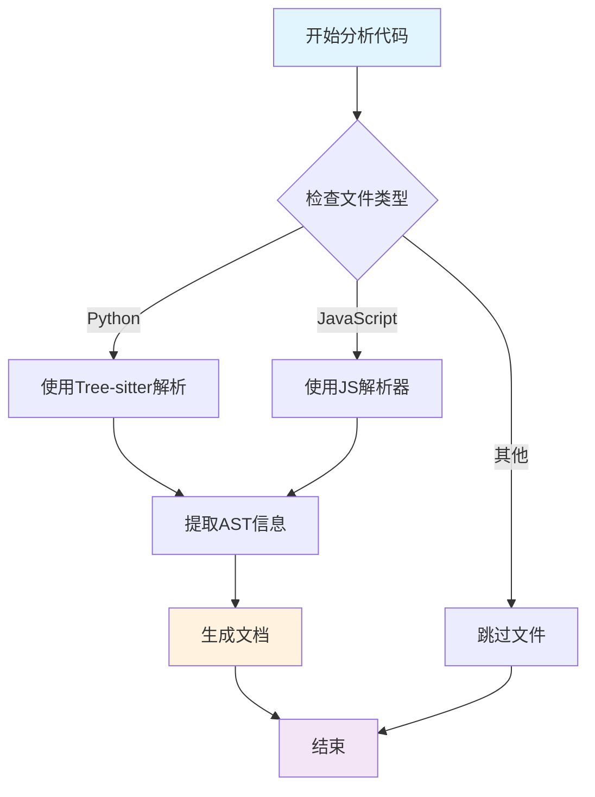
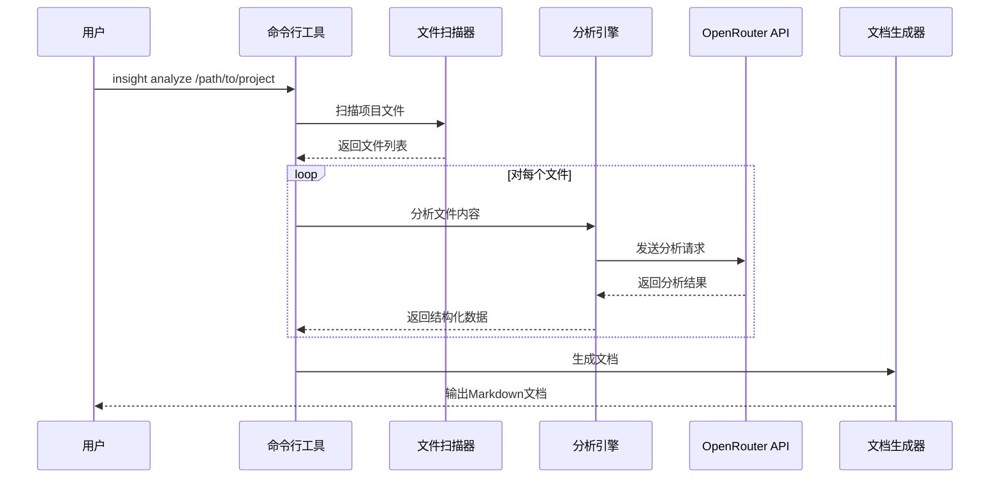
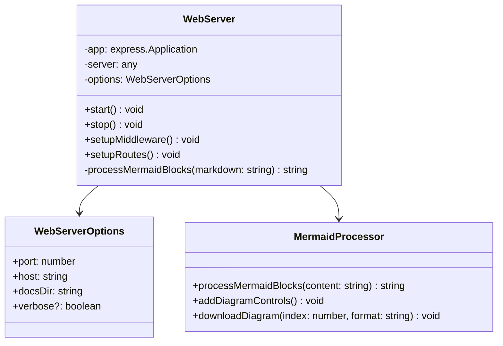
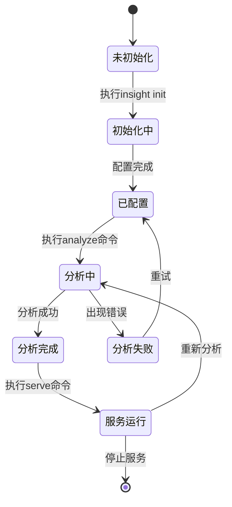
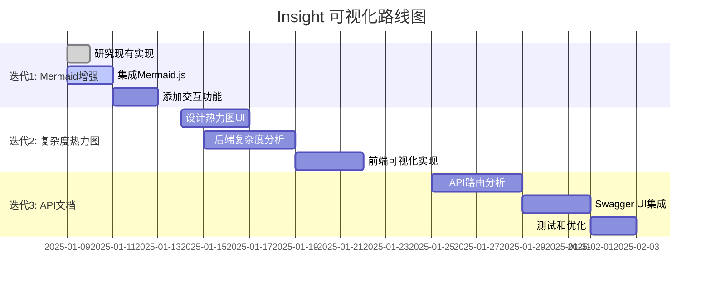
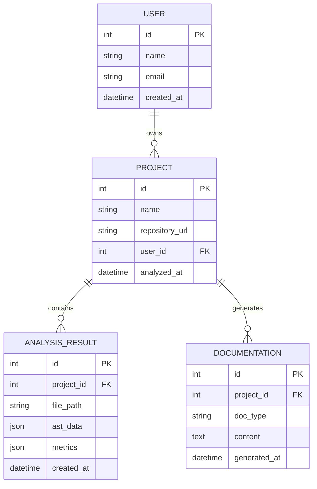
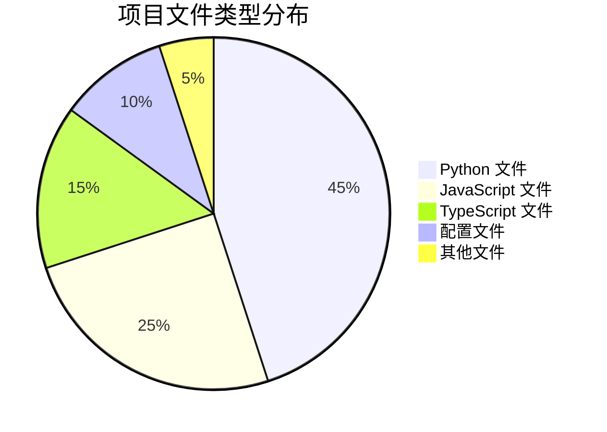

# Mermaid 图表测试文档

这个文档用于测试Insight WebServer的Mermaid图表渲染功能。

## 1. 流程图 (Flowchart)

## 2. 时序图 (Sequence Diagram)

## 3. 类图 (Class Diagram)

## 4. 状态图 (State Diagram)

## 5. 甘特图 (Gantt Chart)

## 6. ER图 (Entity Relationship)

## 7. 饼图 (Pie Chart)

## 测试说明

以上图表应该在Insight的Web服务器中正确渲染，并提供以下功能：

1. ✅ 自动识别mermaid代码块
2. ✅ 使用统一的主题色彩方案（#007acc）
3. ✅ 提供SVG/PNG下载功能
4. ✅ 支持缩放和重置功能
5. ✅ 响应式设计适配移动端

每个图表都应该有对应的控制按钮出现在图表下方。