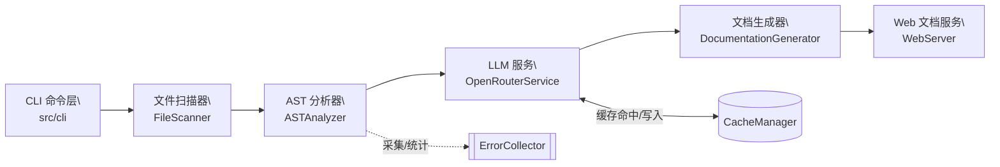
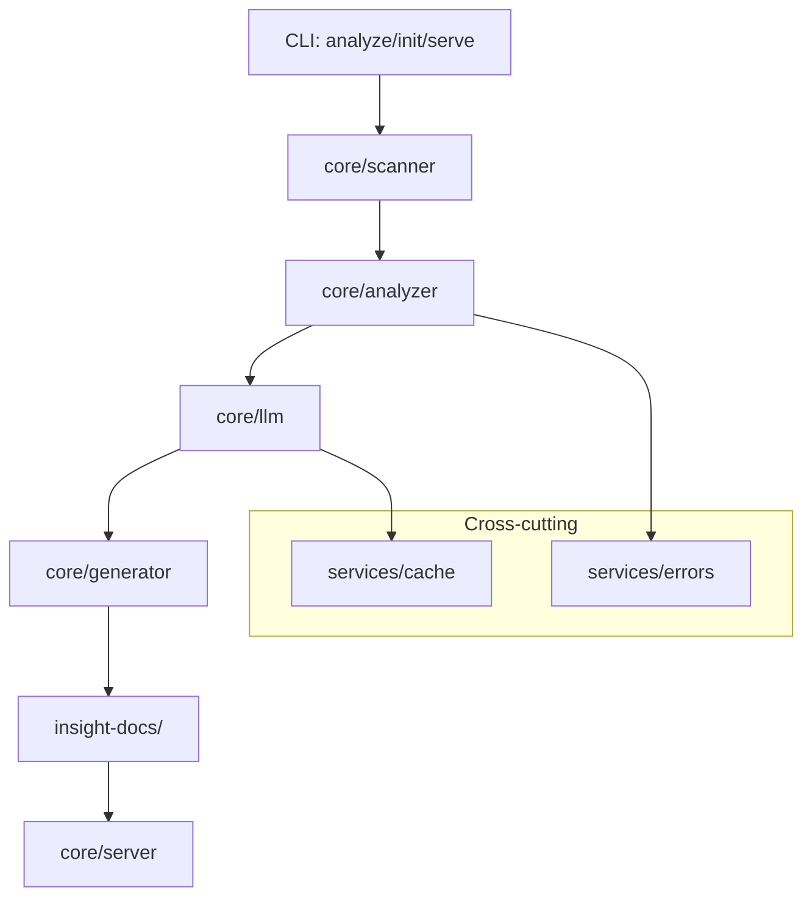

# Insight 架构总览（MVP）

> 本文面向贡献者，概览系统模块、数据流与关键边界，便于后续逐模块深挖与优化。

## 高层流程

## 数据流与产物
- 输入: 目标代码目录（默认聚焦 Python `.py`）。
- 扫描: `FileScanner` 使用 glob + `FileFilter` 构造待分析文件集，附内容哈希/大小/语言等元数据。
- 分析: `ASTAnalyzer` 基于 tree-sitter 提取类/函数/导入/复杂度/类型注解/框架与模式迹象；错误进入 `ErrorCollector`。
- 增强: `OpenRouterService` 读取源码+AST 上下文调用 OpenRouter（带 24h TTL 的 `.insight-cache`），失败走回退/降级。
- 生成: `DocumentationGenerator` 汇总 AST + LLM，产出 `insight-docs/`：
  - `README.md`（项目概览）
  - `ARCHITECTURE.md`（结构+Mermaid 图）
  - `files/*.md`（逐文件文档）
  - `STATISTICS.json`（全局统计）
- 服务: `WebServer` 提供 `/`、`/api/docs`、`/api/health`，前端渲染 Mermaid。

## 关键边界与配置
- 语言支持: 当前聚焦 Python，扩展由 `scanning.includeExtensions` 驱动。
- 性能与成本: LLM 调用强依赖缓存键（源码+AST 摘要+模型名）。
- 错误策略: 默认“遇错继续”，可 `--stop-on-error` 改为首错即停，并支持 `--error-report` 导出 JSON。
- 配置入口: `insight.config.json` 与环境变量（如 `OPENROUTER_API_KEY`、`MODEL`）。

## 模块关系（概念）

