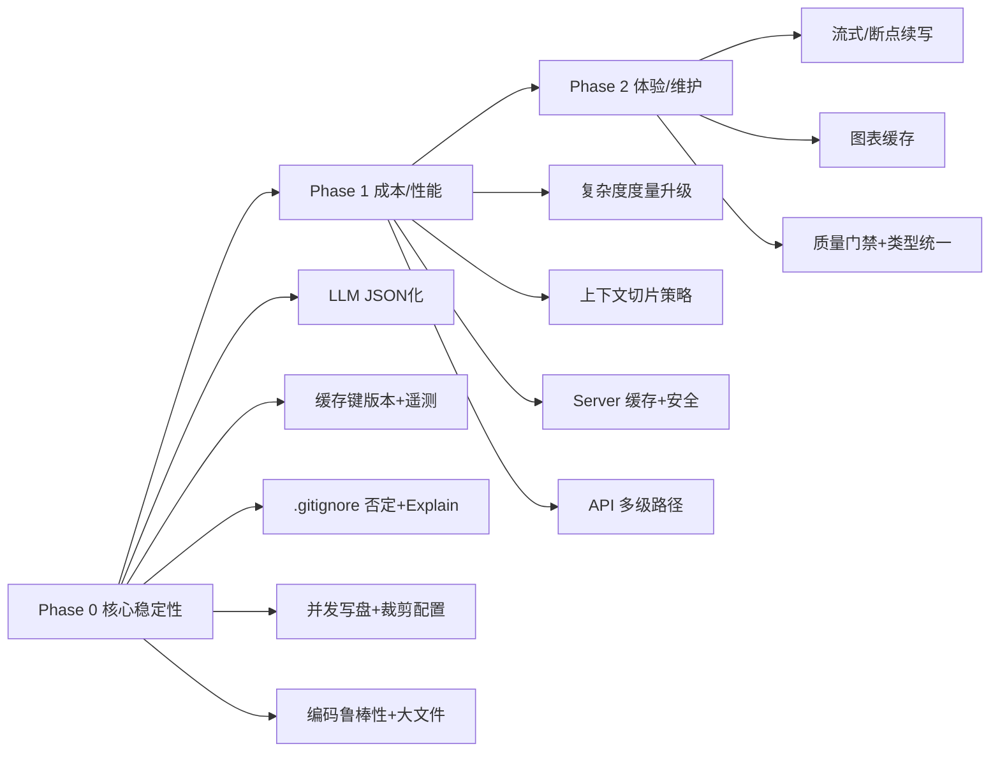

# 全局优化优先级与路线图（MVP 后）

本页从全局视角评估当前实现，给出以“稳定性/成本/性能/体验”为导向的优先级与节奏。目标是先稳住链路与成本，再提升性能与体验。

## 优先级原则
- 稳定优先：失败模式可控、可回退、可观测。
- 成本可见：LLM 成本与命中率可度量、可优化。
- 性能均衡：吞吐/延时与准确度在可接受范围内。
- 体验清晰：可解释、可诊断、可配置。

## P0（立即收益 & 低风险）
1) LLM 输出结构化 JSON + 解析校验（见 RFC-P0-001）
- 影响：显著提升稳定性与可解析度，减少“风格漂移”。
- 动作：提示词强制 JSON schema；解析前做 JSON 校验；失败走回退/降级。
2) 缓存键版本化 + 遥测（见 RFC-P0-002）
- 影响：避免协议调整的伪命中；可见命中率/成本。
- 动作：引入 `promptVersion/modelVersion/parserVersion`；记录命中/请求时长/估算 tokens。
3) .gitignore 否定规则 + Explain 模式
- 影响：扫描与真实 Git 语义一致；排错成本更低。
- 动作：支持 `!pattern`；`--explain-filter` 输出命中链路。
4) 文档生成并发写入 + 图表裁剪可配置
- 影响：大仓库生成提速；图表拥塞降低。
- 动作：p-limit 并发写盘；暴露节点/方法上限与裁剪说明。
5) 编码鲁棒性与大文件策略
- 影响：减少读取/解析失败；避免巨文件拖垮链路。
- 动作：多编码探测；>10MB 策略（跳过/截断/分块）。

## P1（中期收益）
- 复杂度度量替换为稳定算法（控制流/分支计数）。
- 上下文切片（函数/类 Top-K，按复杂度/依赖热度选择，多段合并）。
- Server ETag/Last-Modified + compression/helmet + Markdown 净化与可选鉴权。
- `/api/docs/:path+` 支持多级路径 + 原始 Markdown 模式。

## P2（长期改进）
- 流式/断点续写与项目级速率预算；图表缓存。
- 质量门禁（复杂度阈值/错误阈值）与报告；类型统一（Analyzer vs types 中 AnalysisResult）。

## 路线图（建议 2~4 周）

## 度量与验收
- 成本：单次 analyze 的 tokens/费用、缓存命中率（目标≥70%）。
- 稳定：分析成功率（目标≥95%）、超时/编码错误占比下降。
- 性能：中型仓库端到端用时（目标< N 分钟）、Server TTFB。
- 体验：Explain 输出覆盖率、错误报告完备度、文档渲染成功率。

## 风险与缓解
- OpenRouter 速率/费用波动 → 速率预算、指数退避、fallback 策略。
- 大型仓库 I/O/渲染瓶颈 → 并发/裁剪/缓存与分批写盘。
- 模式/框架识别误报 → 置信度输出 + LLM 交叉验证 + 人工注释通道。
