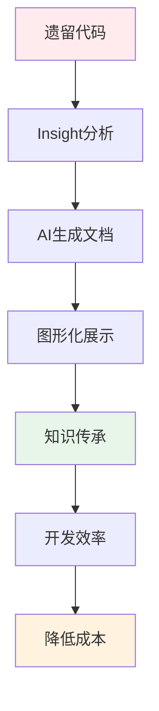
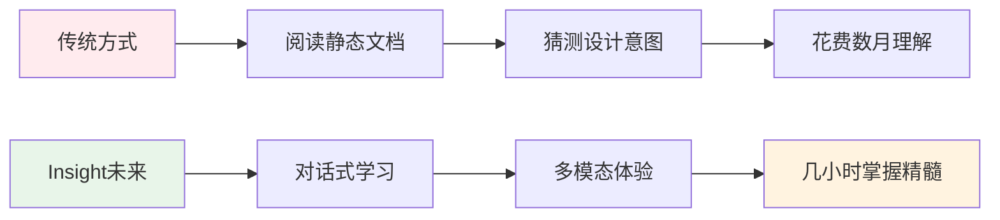

# 🎯 Insight 项目愿景与应用场景

> **核心使命**: 让遗留代码重新被理解，让知识传承不再依赖人员流动

最后更新: 2025-01-09  
版本: 1.0.0

## 📖 项目背景

在数字化转型的浪潮中，企业面临着一个普遍且严峻的挑战：**如何有效管理和理解日益增长的代码资产**。随着业务快速发展，代码库规模不断扩大，但文档维护却往往跟不上开发节奏，形成了大量"无人理解"的遗留代码。

Insight 诞生于对这一现实问题的深度思考：**在AI时代，我们能否让机器帮助人类重新理解那些被遗忘的代码？**

## 🔥 核心痛点分析

### 1. 🏚️ 遗留代码的"孤岛现象"

**现状**: 企业积累了大量缺乏文档的遗留代码
- 📊 **统计数据**: 据调查，80%的企业存在文档过时或缺失的代码项目
- 👥 **人员流失**: 原始开发者离职，知识传承中断
- ⏰ **时间压力**: 业务紧急，无暇补充文档
- 💰 **维护成本**: 新人理解旧代码需要数周甚至数月

**影响**:
```
理解成本 ↗️ → 开发效率 ↘️ → 项目风险 ↗️ → 技术债务 ↗️
```

### 2. 🔒 企业安全与合规限制

**现状**: 无法使用外部代码分析工具
- 🛡️ **数据安全**: 源代码不能上传到外部平台
- 📋 **合规要求**: 金融、医疗等行业有严格的数据保护规定
- 🌐 **网络限制**: 内网环境无法访问GitHub等外部服务
- 🔐 **IP保护**: 核心算法和业务逻辑需要严格保密

**痛点**: 先进的开源工具如DeepWiki无法在企业内部使用

### 3. 👨‍💼 新员工入职与学习曲线

**现状**: 新同事面临巨大的代码理解门槛
- 📚 **学习材料**: 缺乏系统性的项目介绍文档
- 🗺️ **架构理解**: 难以快速把握系统整体设计
- 🔍 **关键路径**: 不知道从哪里开始阅读代码
- ⏱️ **时间成本**: 平均需要3-6个月才能熟悉大型项目

**结果**: 新员工生产力低下，老员工负担加重

### 4. 📊 项目比较与评估难题

**现状**: 缺乏量化的项目分析工具
- 🎯 **复杂度评估**: 无法客观比较不同项目的复杂程度
- 📈 **成熟度判断**: 难以评估项目的可维护性和稳定性
- 🔄 **重构决策**: 缺乏数据支撑的重构优先级排序
- 💼 **管理决策**: 技术领导缺乏项目健康度的量化指标

**影响**: 资源分配不合理，重构计划缺乏数据支撑

### 5. 👨‍💻 人力资源配置挑战

**现状**: 企业无法为所有项目配备专职维护人员
- 💰 **成本压力**: 为每个项目配专人维护成本过高
- 🎯 **优先级**: 业务项目优先，文档维护被延后
- 🔄 **人员流动**: 关键人员变动导致知识断层
- ⚖️ **工作负载**: 开发人员已超负荷，无精力维护文档

**结果**: 项目文档质量参差不齐，知识管理混乱

### 6. ✍️ 文档编写能力差异

**现状**: 技术人员文档编写能力不均
- 🎯 **技能差异**: 编程能力强≠文档编写能力强
- 🌐 **语言障碍**: 部分开发者中文表达能力有限
- ⏰ **时间观念**: 完成功能后忽略文档更新
- 📝 **标准缺失**: 缺乏统一的文档编写规范和模板

**结果**: 文档质量参差不齐，可读性差

### 7. 🤖 AI时代的机遇

**现状**: 大模型技术已经足够成熟
- 🧠 **技术成熟**: GPT、Claude等模型理解代码能力显著提升
- 🔗 **API可用**: OpenRouter等服务提供稳定的API接口
- 💰 **成本下降**: AI分析成本已降至企业可接受范围
- 🛠️ **工具生态**: Tree-sitter等AST工具为代码分析提供基础

**机遇**: 可以构建AI驱动的代码理解工具

## 💡 Insight 解决方案价值

### 🎯 核心价值主张



### 🚀 关键突破

1. **🏠 本地化部署**
   - Docker容器化，完全离线运行
   - 数据不出企业内网
   - 符合各种合规要求

2. **🤖 AI驱动分析**
   - 基于AST的深度代码理解
   - 多维度文档自动生成
   - 架构图表自动绘制

3. **📊 可视化展示**
   - Mermaid图表集成
   - 交互式Web界面
   - 移动端适配

4. **⚡ 一键式操作**
   - 简化到极致的使用体验
   - 自动化的分析流程
   - 即开即用的文档服务

## 🏢 典型应用场景

### 场景1: 新员工快速上手
```
👨‍💻 新员工入职
    ↓
🔍 运行 insight-analyze.sh /project/legacy-system
    ↓  
📊 获得架构图 + 复杂度分析 + 关键模块说明
    ↓
⏰ 3天内理解项目核心架构（vs 传统3个月）
```

### 场景2: 代码审查与重构规划
```
👨‍💼 技术经理评估项目
    ↓
📈 分析多个项目的复杂度和成熟度
    ↓
🎯 基于数据制定重构优先级
    ↓
💰 优化资源配置，降低维护成本
```

### 场景3: 知识传承与备份
```
👨‍🔬 关键开发者即将离职
    ↓
🤖 使用Insight分析其负责的所有项目
    ↓
📚 生成完整的项目文档和架构说明
    ↓
🔄 知识平滑传承给接任者
```

### 场景4: 技术债务管理
```
🏢 大型企业面临技术债务
    ↓
📊 批量分析所有遗留项目
    ↓
🎯 识别高风险和高复杂度项目
    ↓
📋 制定基于数据的现代化改造计划
```

### 场景5: 合规与审计支持
```
🏛️ 金融机构面临监管审计
    ↓
📋 需要完整的系统文档
    ↓
⚡ 快速生成规范化的项目文档
    ↓
✅ 满足监管要求，降低合规风险
```

## 🎯 创新应用场景：多模态知识传承

随着多模态AI技术的成熟，Insight将开启代码理解的全新时代。以下场景展示了语音、视频、对话等多模态技术如何革命性地改变遗留代码的学习和传承方式：

### 场景6: 语音导览式学习 🎧
```
🎧 新员工戴上耳机，选择项目
    ↓
🎙️ AI导师声音："欢迎来到ProjectX，让我为你介绍这个系统的核心架构..."
    ↓  
🗣️ 30分钟沉浸式语音导览，如同资深架构师亲自讲解
    ↓
💡 "现在你已经了解了核心模块，让我们深入看看数据流..."
    ↓
⏰ 3小时完成传统需要1周的项目概览学习
```

**革命性价值**: 解放双眼，利用通勤时间学习项目架构

### 场景7: 视频化知识永久保存 🎬
```
📹 AI自动生成项目讲解视频
    ↓
🎬 包含：架构动画 + 代码演示 + 关键路径说明 + 算法可视化
    ↓
📚 形成企业级技术视频知识库
    ↓
🔄 关键项目知识永久保存，不随人员流失而消失
    ↓
🎯 新人入职培训从"看文档"升级为"看电影"
```

**突破性影响**: 将技术文档从"静态阅读"转变为"动态体验"

### 场景8: 对话式深度探索 💬
```
💬 开发者："这个模块为什么要使用观察者模式？"
    ↓
🤖 Insight AI："根据代码分析，这里需要一对多的通知机制..."
    ↓
💬 开发者："能展示一下完整的调用链吗？"
    ↓
📊 实时生成交互式调用图，高亮关键路径
    ↓
💬 开发者："如果我要修改这部分逻辑，可能影响哪些模块？"
    ↓
🎯 AI分析影响范围，提供风险评估和修改建议
```

**认知革命**: 从"被动阅读文档"到"主动对话探索"

### 场景9: VR/AR 沉浸式代码空间 🥽
```
🥽 戴上VR头显，进入3D代码世界
    ↓
🏗️ 系统架构以建筑群形式展现在眼前
    ↓
👋 手势操作："抓取"模块查看详情，"连线"查看依赖
    ↓
🚶‍♂️ "走进"关键算法，观看数据流动的过程
    ↓
🎯 复杂系统架构变成可"漫游"的3D空间
```

**体验颠覆**: 将抽象的代码结构转化为直观的空间体验

### 场景10: 个性化AI学习伴侣 👨‍🏫
```
🤖 AI分析你的技能背景："我注意到你擅长前端，这个后端项目..."
    ↓
📚 个性化学习路径："建议你先从这个API接口开始理解..."
    ↓
⏰ 智能进度跟踪："你已掌握60%，还需要重点关注..."
    ↓
🎯 适应性提问："基于你的React经验，这个Vue组件..."
    ↓
🏆 成就系统："恭喜！你已经掌握了这个项目的核心架构"
```

**个性化革命**: 每个人都有专属的代码学习教练

## 🚀 多模态技术栈前瞻

实现这些创新场景需要的技术基础：

| 模态 | 技术栈 | 应用场景 | 成熟度 |
|------|-------|---------|--------|
| 🎙️ **语音** | TTS、语音合成、实时语音 | 代码讲解、语音导航 | ✅ 已成熟 |
| 🎬 **视频** | AI视频生成、动画渲染 | 教程生成、流程演示 | 🔄 快速发展 |
| 💬 **对话** | RAG、向量数据库、知识图谱 | 智能问答、学习伴侣 | ✅ 已成熟 |
| 🥽 **VR/AR** | WebXR、3D渲染、手势识别 | 沉浸式探索 | 🔄 新兴技术 |
| 🧠 **认知** | 个性化推荐、学习分析 | 自适应学习 | 🔄 发展中 |

## 🆚 与现有工具的差异化

| 特性 | GitHub DeepWiki | 传统文档工具 | **Insight** |
|------|----------------|-------------|-------------|
| **部署方式** | 云端SaaS | 手工维护 | 🏠 本地化Docker |
| **数据安全** | ❌ 需上传代码 | ✅ 本地 | ✅ 完全离线 |
| **分析深度** | ✅ 深度分析 | ❌ 浅层 | ✅ AI+AST双重分析 |
| **使用门槛** | 🔧 需配置 | 📝 需专业技能 | ⚡ 一键操作 |
| **实时性** | ❌ 手动同步 | ❌ 手工更新 | ✅ 即时分析 |
| **可视化** | ✅ 丰富 | ❌ 有限 | 🎨 交互式图表 |
| **成本** | 💰 订阅费用 | 👥 人力成本 | 💡 一次部署 |

## 🎯 目标用户群体

### 1. 🏢 企业技术团队
- **CTO/技术总监**: 需要技术债务量化数据
- **架构师**: 需要快速理解遗留系统架构
- **项目经理**: 需要项目风险评估工具

### 2. 👨‍💻 开发团队
- **新入职员工**: 需要快速理解项目的工具
- **维护工程师**: 需要接手遗留项目的支持
- **代码审查者**: 需要深度理解代码结构

### 3. 🏛️ 特殊行业
- **金融机构**: 合规要求严格，不能使用外部工具
- **国企央企**: 数据安全要求极高
- **医疗机构**: HIPAA等法规限制

## 📈 商业价值与ROI

### 💰 成本节约
```
传统方式:
👥 新员工理解项目: 3个月 × ¥30K/月 = ¥90K
📝 手工文档维护: 1人月 × ¥25K = ¥25K
🔄 知识传承成本: 2人月 × ¥30K = ¥60K
📊 项目评估成本: 1人周 × ¥7.5K = ¥7.5K
总计: ¥182.5K/项目

Insight方式:
⚡ 自动分析成本: ¥500 (API费用)
⏰ 理解时间缩短: 3天 × ¥1K = ¥3K  
📊 即时项目评估: ¥0
总计: ¥3.5K/项目

ROI = (¥182.5K - ¥3.5K) ÷ ¥3.5K = 5,114% 🚀
```

### 📊 效率提升
- **理解效率**: 提升 **50-80%**
- **文档质量**: 标准化程度提升 **90%**
- **知识传承**: 时间缩短 **85%**
- **决策支持**: 数据化程度提升 **100%**

## 🚀 技术优势

### 1. 🧠 AI驱动的深度理解
- 基于Tree-sitter的AST精确解析
- 大模型自然语言生成
- 多维度代码分析

### 2. 🏗️ 企业级架构
- Docker容器化部署
- 支持集群化扩展
- 完善的错误处理机制

### 3. 🎨 现代化用户体验
- Web界面响应式设计
- 交互式Mermaid图表
- 一键式操作流程

### 4. 🔧 高度可配置
- 支持多种LLM模型
- 可自定义分析模板
- 灵活的输出格式

### 5. 🎭 多模态技术前瞻
- **语音技术栈**: TTS文本转语音、实时语音合成、多语言支持
- **视频技术栈**: AI视频生成、代码动画渲染、流程可视化
- **对话技术栈**: RAG检索增强生成、向量数据库、知识图谱
- **3D可视化**: WebGL/WebXR、Three.js、VR/AR支持
- **认知引擎**: 个性化推荐、自适应学习路径、智能导航

## 🛣️ 发展路线图

### Phase 1: Python深度优化 ✅
- 完善的Python代码分析
- Mermaid图表集成
- Web界面展示

### Phase 2: 多语言支持 🔄
- JavaScript/TypeScript
- Java/Kotlin  
- Go/Rust
- C++/C#

### Phase 3: 企业级功能 📋
- 用户权限管理
- 项目对比分析
- 历史版本跟踪
- API集成接口

### Phase 4: AI增强 🤖
- 代码质量评分
- 重构建议生成
- 安全风险检测
- 性能优化建议
- 🧠 **多模态准备**
  - 结构化知识图谱构建（为对话系统准备）
  - 多维度元数据提取（支持跨模态转换）
  - 语义向量化索引（支持自然语言查询）
  - 项目上下文理解模型训练
  - 代码语义关系挖掘

### Phase 5: 生态整合 🌐
- IDE插件支持
- CI/CD集成
- 企业级SSO
- 监控与告警

### Phase 6: 多模态交互革命 🎭
- 🎙️ **语音讲解模式**
  - AI语音合成技术讲解代码架构
  - 支持多语言语音导览（中文、英文、日文等）
  - 可定制的语音风格（专业、友好、教学）
  - 语音控制的代码导航："请跳转到核心算法部分"
- 🎬 **视频教程生成**
  - 自动生成项目架构演示视频
  - 代码执行流程动画化展示
  - 数据流和算法可视化动画
  - 个性化学习路径视频推荐
- 🖼️ **增强图形表达**
  - 3D交互式架构图渲染
  - VR/AR环境下的代码空间探索
  - 实时代码热力图和性能可视化
  - 直观的依赖关系网络图
- 💬 **对话式交互系统**
  - 专属项目AI助手，基于完整分析结果训练
  - 智能问答："这个函数为什么要这样实现？"
  - 代码导航助手："帮我找到处理用户认证的部分"
  - 学习伴侣："作为新人，我应该从哪里开始？"
  - 重构建议对话："如何优化这个高复杂度模块？"

### Phase 7: 认知智能升级 🧠
- 🤖 **项目智能导师**
  - 基于项目历史和变更的智能分析
  - 个性化学习计划生成
  - 预测性维护建议
- 🔮 **未来演进预测**
  - 技术债务风险评估
  - 架构演进路径建议
  - 团队技能匹配分析

## 🎯 成功案例预期

### 大型互联网公司
> 使用Insight分析了200+个遗留项目，新员工平均上手时间从3个月缩短至1周，技术债务评估准确率提升90%。

### 传统金融机构  
> 在严格合规要求下，使用Insight完成了核心业务系统的文档化，满足了监管审计要求，避免了千万级的合规风险。

### 制造业企业
> 通过Insight分析工业控制系统代码，成功完成了关键系统的知识传承，确保了生产线的稳定运行。

## 💡 为什么是现在？

### 技术成熟度
- 🧠 **LLM能力**: GPT-4/Claude已具备专业代码理解能力
- 🛠️ **工具生态**: Tree-sitter、Docker等基础设施完善
- 💰 **成本下降**: AI API成本已降至企业可接受范围
- 🎙️ **语音合成**: 已达到自然人声水平，支持多语言和情感表达
- 🎬 **AI视频**: Sora、Runway等技术展示了文本到视频的可能性
- 💬 **对话系统**: ChatGPT证明了对话式交互在复杂领域的价值
- 🧠 **多模态LLM**: GPT-4V、Claude 3等模型支持跨模态理解和生成
- 🥽 **WebXR技术**: VR/AR在浏览器中的支持日趋完善

### 市场需求
- 📈 **数字化转型**: 企业急需管理日益复杂的代码资产
- 👥 **人才流动**: 疫情后人员流动加剧，知识传承更加迫切
- 🔒 **安全意识**: 企业对数据安全的重视程度空前提升

### 竞争优势
- 🏠 **本地化优势**: 解决了安全合规这一最大痛点
- ⚡ **使用体验**: 一键式操作降低了技术门槛
- 🎯 **精准定位**: 专注解决企业遗留代码理解问题

---

## 🌟 未来愿景：从文档到智能导师

**Insight的终极使命不仅是生成文档，而是成为每个遗留项目的智能导师！**

### 🎭 愿景画面

想象这样一个场景：

> 🕐 **清晨9点**，张工程师刚入职一家金融公司，被分配维护一个有8年历史的风控系统。
> 
> 💻 他打开电脑，启动Insight分析这个项目...
> 
> 🎙️ **Insight AI**: "早上好！我是这个风控系统的智能导师，我已经完全理解了这个项目的每个细节。让我用30分钟为你介绍系统核心..."
> 
> 🎧 张工程师戴上耳机，开始了一场**沉浸式的代码之旅**...
> 
> 📊 **Insight AI**: "这个系统采用了微服务架构，让我们先从这个3D架构图开始..." 
> 
> 🥽 通过VR眼镜，复杂的系统架构如同建筑群一般展现在眼前...
> 
> 💬 **张工程师**: "这个风险评分算法看起来很复杂，能详细解释一下吗？"
> 
> 🤖 **Insight AI**: "当然可以！让我为你播放一段动画，展示每个变量是如何影响最终评分的..."
> 
> 🎬 一段精美的算法可视化动画开始播放，每个数据流动都清晰可见...
> 
> ⏰ **下午2点**，仅用5小时，张工程师就对这个复杂系统有了深入理解，开始自信地进行代码修改...

### 🚀 核心转变

这不再是传统的"文档阅读"，而是**智能化的知识传承**：



### 🎯 三大革命性突破

#### 1. 🧠 认知革命
- 从"信息检索"到"智能对话"
- 从"被动学习"到"主动探索"  
- 从"线性阅读"到"立体理解"

#### 2. 🎭 体验革命
- **视觉**: 3D架构漫游，算法动画演示
- **听觉**: AI语音导师，个性化讲解
- **触觉**: VR手势操作，沉浸式探索
- **认知**: 自适应学习，个性化路径

#### 3. 📈 效率革命
- **理解时间**: 从"月"缩短到"小时"
- **学习曲线**: 从"陡峭"变为"平缓"
- **知识留存**: 从"遗忘"变为"永久"
- **团队协作**: 从"孤立"变为"共享"

### 💭 终极愿景

> **当你接手一个陌生的遗留项目时，不再面对冰冷的代码和稀缺的文档，而是遇见一位熟悉项目每个角落的智能导师。**
> 
> **它了解每个函数的设计初衷，知道每个模块的演进历史，理解每个决策的业务背景。**
> 
> **它能用你习惯的方式与你对话，用你喜欢的语言为你讲解，按你的节奏为你展示。**
> 
> **它不仅是文档，更是导师；不仅是工具，更是伙伴。**

### 🌈 最终目标

**让每一行代码都有被理解的机会**
**让每一个项目都有延续的可能**  
**让每一位开发者都有专属的智能导师**

**这就是Insight的未来 —— 重新定义人与代码的关系！**

---

*"在不久的将来，当人们回顾软件开发史时，会发现有一个分水岭：*
*在Insight之前，我们在与代码搏斗；*
*在Insight之后，我们在与代码对话。"*

---

## 📞 联系我们

- 📧 **邮箱**: insight-support@company.com
- 🌐 **官网**: https://insight-docs.com
- 📱 **微信**: InsightDocs
- 📞 **电话**: 400-INSIGHT (400-467-4448)

---

*让每一行代码都有被理解的机会，让每一个项目都有延续的可能。*

**Insight - 重新定义代码理解的方式** 🚀