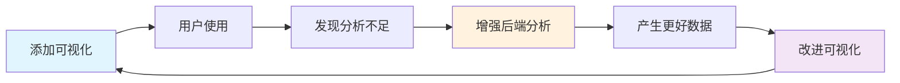

# 🎯 Insight 渐进式前端可视化路线图

> 最后更新: 2025-01-09
> 版本: 1.0.0

## 📌 核心原则

### 1. **后端优先 (Backend First)**
每个可视化功能都应该推动后端分析能力的提升。前端是展示层，后端分析是核心竞争力。

### 2. **原子化开发 (Atomic Development)**
每次只实现一个小功能，可独立PR合并。避免大规模重构，保持代码库稳定。

### 3. **不破坏现有功能 (Non-Breaking)**
保持现有markdown输出和API完整性。新功能应该是增强而非替代。

### 4. **数据驱动 (Data-Driven)**
前端展示倒逼后端产生更有价值的分析数据。

> **核心思想**: 前端可视化的价值在于帮助发现后端分析的不足，每个图形化功能都应该引出一个问题："为了更好地展示这个，后端还需要分析什么？"

## 🛠️ 技术栈选型

### 前端框架: React 生态系统
- **React 18+**: 成熟度最高，生态系统完善
- **TypeScript**: 类型安全，与后端保持一致
- **Vite**: 快速的开发构建工具
- **React Router**: 客户端路由
- **Zustand/Jotai**: 轻量级状态管理
- **TanStack Query**: 数据获取和缓存
- **Tailwind CSS**: 原子化CSS框架
- **shadcn/ui**: 高质量React组件库

### 可视化库
- **Mermaid.js**: Markdown图表渲染
- **D3.js**: 复杂交互式图表
- **Recharts**: 基于React的图表库
- **React Flow**: 流程图和网络图
- **Monaco Editor**: VS Code编辑器组件

### 工具链
- **ESLint + Prettier**: 代码规范
- **Vitest + React Testing Library**: 测试
- **Storybook**: 组件开发和文档
- **Playwright**: E2E测试

## 📊 长期迭代计划

### 🚀 迭代 1: Mermaid 图表增强 (2周)

#### 前端改进
- 在现有 WebServer 中添加 mermaid.js CDN
- 自动渲染 markdown 中的 mermaid 代码块
- 添加图表下载功能（SVG/PNG）
- 支持图表缩放和平移

#### 推动的后端分析
- 更精确的类继承关系分析
- 方法调用链分析
- 数据流向图生成
- 状态机检测（用于生成状态图）

#### 实现细节
```typescript
// 修改 WebServer.ts 的 wrapMarkdownInHTML 方法
// 添加 mermaid CDN 和初始化脚本
<script src="https://cdn.jsdelivr.net/npm/mermaid/dist/mermaid.min.js"></script>
<script>
  mermaid.initialize({ 
    startOnLoad: true,
    theme: 'default',
    themeVariables: {
      primaryColor: '#007acc'
    }
  });
</script>
```

#### 成功指标
- [ ] Mermaid图表自动渲染
- [ ] 支持5种图表类型
- [ ] 图表可下载
- [ ] 性能：<100ms渲染时间

---

### 🔥 迭代 2: 复杂度热力图 (3周)

#### 前端改进
- 创建独立的 `/complexity` 路由
- 使用 D3.js 绘制树状热力图
- 交互式tooltip显示详细指标
- 复杂度阈值自定义

#### 推动的后端分析
```python
# 需要增强的分析指标
- 圈复杂度 (Cyclomatic Complexity)
- 认知复杂度 (Cognitive Complexity)  
- 嵌套深度 (Nesting Depth)
- Halstead 复杂度指标
- 代码行数 vs 有效代码行数
- 测试覆盖率（如果可获取）
```

#### UI设计
```
┌─────────────────────────────────────┐
│  Complexity Heatmap                 │
├─────────────────────────────────────┤
│  [树状图展示文件和复杂度]            │
│  ■ 高复杂度 (>20)                   │
│  ■ 中复杂度 (10-20)                 │
│  ■ 低复杂度 (<10)                   │
│                                     │
│  点击查看详情...                     │
└─────────────────────────────────────┘
```

#### 发现的问题
- "为什么这个文件复杂度高？"
- "哪些函数需要重构？"
- "复杂度趋势如何？"

---

### 🔌 迭代 3: API 端点文档 (3周)

#### 前端改进
- Swagger-like UI 界面
- 请求/响应示例
- Try it out 功能
- OpenAPI规范导出

#### 推动的后端分析
```python
# Flask/FastAPI/Django 路由分析
@app.route('/api/users/<int:user_id>', methods=['GET', 'POST'])
def handle_user(user_id: int):
    """
    需要分析:
    - HTTP方法
    - URL参数类型
    - 请求体schema
    - 响应格式
    - 认证要求
    - 错误码
    """
```

#### React组件结构
```tsx
// src/components/ApiExplorer/
├── ApiExplorer.tsx          // 主容器
├── EndpointList.tsx         // 端点列表
├── EndpointDetail.tsx       // 端点详情
├── RequestBuilder.tsx       // 请求构建器
└── ResponseViewer.tsx       // 响应查看器
```

---

### 🗄️ 迭代 4: 数据库模型关系图 (4周)

#### 前端改进
- 使用 React Flow 构建ER图
- 表关系交互式导航
- 字段搜索和过滤
- SQL预览

#### 推动的后端分析
```python
# ORM模型深度分析
class User(db.Model):
    id = db.Column(db.Integer, primary_key=True)
    posts = db.relationship('Post', backref='author')
    
# 需要提取:
- 表结构
- 字段类型和约束
- 关系（1:1, 1:N, N:N）
- 索引信息
- 触发器和约束
```

#### 可视化效果
```
User ──────┐
│id        │      ┌─── Post
│name      │──────│author_id
│email     │      │title
│created_at│      │content
```

---

### 🕸️ 迭代 5: 依赖关系网络图 (3周)

#### 前端改进
- D3.js 力导向图
- 模块分组和聚类
- 循环依赖警告
- 依赖路径追踪

#### 推动的后端分析
```python
# 导入分析增强
import numpy as np  # 外部依赖
from .utils import helper  # 内部依赖
from ..core import *  # 危险的通配符导入

# 分析维度:
- 导入深度
- 循环依赖
- 未使用的导入
- 动态导入
- 条件导入
```

---

### 🧪 迭代 6: 测试覆盖率可视化 (4周)

#### 前端改进
- 代码覆盖率热力图
- 测试用例关联
- 覆盖率趋势图
- 未测试代码高亮

#### 推动的后端分析
```python
# 测试分析
def test_calculator():
    assert calc.add(1, 2) == 3
    
# 需要分析:
- 测试文件映射
- 覆盖的代码行
- 分支覆盖率
- Mock使用情况
- 测试执行时间
```

---

### 🎨 迭代 7: 设计模式识别 (5周)

#### 前端改进
- 模式标注和说明
- 模式使用统计
- 最佳实践建议
- 反模式警告

#### 推动的后端分析
```python
# 单例模式检测
class Singleton:
    _instance = None
    def __new__(cls):
        if cls._instance is None:
            cls._instance = super().__new__(cls)
        return cls._instance

# 需要识别:
- 23种GoF设计模式
- Python特有模式
- 架构模式(MVC, Repository等)
- 代码坏味道
```

---

### ⚡ 迭代 8: 性能瓶颈标注 (5周)

#### 前端改进
- 性能火焰图
- 慢函数标记
- 优化建议
- Before/After对比

#### 推动的后端分析
```python
# 性能分析
for i in range(n):
    for j in range(n):
        matrix[i][j] = compute(i, j)  # O(n²)
        
# 需要分析:
- 时间复杂度
- 空间复杂度
- 数据库N+1问题
- 缓存机会
- 异步优化点
```

## 📈 实施策略

### 第一阶段: 最小化改动 (迭代1-3)
```bash
# 目录结构
src/
├── core/
│   └── server/
│       ├── WebServer.ts (增强)
│       └── static/
│           ├── mermaid-viewer.html
│           ├── complexity-map.html
│           └── api-explorer.html
```

### 第二阶段: React应用集成 (迭代4-6)
```bash
# 新增React应用
src/
├── web/                    # 新增
│   ├── src/
│   │   ├── App.tsx
│   │   ├── components/
│   │   ├── hooks/
│   │   └── pages/
│   ├── package.json
│   └── vite.config.ts
```

### 第三阶段: 深度集成 (迭代7-8)
```bash
# 完整的前后端协作
src/
├── core/
│   ├── analyzer/
│   │   └── patterns/     # 新增模式识别
│   └── performance/       # 新增性能分析
├── web/
│   └── src/
│       └── features/      # 功能模块化
```

## 🔄 价值循环



## 📝 每次迭代的交付物

### 必须交付
1. **功能代码**: 可工作的最小实现
2. **测试用例**: 单元测试 + 集成测试
3. **文档更新**: README和API文档
4. **性能基准**: 性能测试结果

### 可选交付
1. **演示视频**: 功能演示
2. **设计文档**: 架构决策记录
3. **用户反馈**: 试用报告

## 🎯 成功标准

### 技术指标
- 页面加载时间 < 2秒
- 交互响应时间 < 100ms
- 浏览器兼容性: Chrome/Firefox/Safari最新版
- 移动端适配: 响应式设计

### 业务指标
- 用户理解代码时间减少 50%
- 发现的代码问题增加 30%
- 文档生成后的二次分析需求
- 用户满意度 > 4.5/5

## 🚦 风险管理

### 技术风险
| 风险 | 概率 | 影响 | 缓解措施 |
|-----|-----|------|---------|
| 性能问题 | 中 | 高 | 渐进式加载，虚拟滚动 |
| 浏览器兼容 | 低 | 中 | Polyfill，渐进增强 |
| 数据量过大 | 高 | 高 | 分页，懒加载，数据聚合 |

### 项目风险
| 风险 | 概率 | 影响 | 缓解措施 |
|-----|-----|------|---------|
| 范围蔓延 | 高 | 高 | 严格遵守原子化原则 |
| 破坏核心功能 | 低 | 极高 | 完整测试覆盖，特性开关 |
| 维护成本增加 | 中 | 中 | 模块化设计，清晰文档 |

## 📅 时间线 (2025)

```
Q1 2025 (1-3月)
├── 1月: 迭代1 - Mermaid增强
├── 2月: 迭代2 - 复杂度热力图
└── 3月: 迭代3 - API文档

Q2 2025 (4-6月)
├── 4月: 迭代4 - 数据库ER图
├── 5月: 迭代5 - 依赖网络图
└── 6月: 中期评估和调整

Q3 2025 (7-9月)
├── 7月: 迭代6 - 测试覆盖率
├── 8月: 迭代7 - 设计模式
└── 9月: 迭代8 - 性能分析

Q4 2025 (10-12月)
├── 10月: 集成和优化
├── 11月: 用户测试
└── 12月: 正式发布 v2.0
```

## 🔗 相关文档

- [技术架构](arch.md)
- [产品需求](prd.md)
- [部署指南](deployment.md)
- [API文档](api.md)

## 📞 联系方式

- GitHub Issues: [项目Issues](https://github.com/jackypanster/insight/issues)
- 技术讨论: 在Issue中使用 `visualization` 标签

---

*本文档是活文档，会随着项目进展不断更新*
*遵循"后端优先，渐进增强"的核心原则*