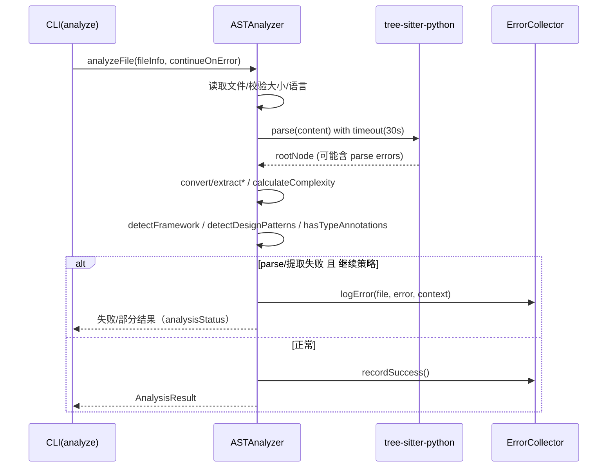

# 分析器子系统指南（src/core/analyzer）

## 职责与范围
- 基于 tree-sitter 对 Python 源码进行结构化分析，提取类/函数/导入/全局变量/复杂度，并侦测框架与设计模式迹象。

## 主要文件
- `ASTAnalyzer.ts`：核心分析器。支持超时保护（30s）、大文件限制（由扫描器控制），与错误收集集成。

## 输入/输出
- 输入：`FileInfo`（含 path/hash/size/language）。
- 输出：`AnalysisResult`：
  - ast（可空）、functions/classes/imports/globalVariables
  - lines/complexity/errors
  - framework（django/flask/fastapi/generic/unknown）
  - patterns（Singleton/Factory/Builder/Observer/Decorator/Strategy 等）
  - analysisStatus（success/partial/failed）

## 失败与可观测性
- 继续策略：默认 `continueOnError=true`，错误通过 `ErrorCollector.logError` 分类记录并继续流水线。
- 常见错误：语法/编码/超时/内存/文件访问；`DEBUG` 环境下输出堆栈与解析细节。
- 统计：`getAnalysisStats(results)` 汇总文件、函数、类、行数、复杂度均值与语言分布。

## 精度与边界
- 当前语言聚焦 Python；其他语言将返回“不支持语言”。
- AST 转换与节点提取做了限深/数量裁剪，避免内存问题。
- 复杂度估算为轻量启发式，后续可替换为更严格度量。

## 扩展建议
- 新语言支持：初始化对应 parser，完善 extract* 系列方法与模式/框架检测。
- 模式库扩展：在 `detectDesignPatterns/ detectClassPatterns` 增加规则。

## 快速验证
```bash
# 小集分析并查看成功/失败与错误分布
insight dev analyze ./examples --max-files 5 --verbose --error-report
```

## 深入细节（实现脉络）
- analyzeFile(fileInfo, continueOnError)
  - 读取文件与大小校验（>10MB 直接报错）→ 仅支持 `python`，其他语言视为不支持。
  - 解析 AST（tree-sitter-python，设置 30s 超时保护）。若 rootNode 有 parse errors，则标记为 partial。
  - 分步提取（均带 try-catch，失败不致命）：
    - convertToASTNode（限深/限儿子数，避免内存膨胀）
    - extractFunctions / extractClasses / extractImports / extractGlobalVariables
    - 计算复杂度 calculateComplexity（启发式）
    - detectFramework（基于导入）/ detectDesignPatterns（类/函数特征）/ hasTypeAnnotations
  - 组装 AnalysisResult（含 lines、complexity、errors、patterns、framework、analysisStatus）。
  - 错误策略：continueOnError=true 时，调用 ErrorCollector.logError() 并返回失败结果；否则抛出。
  - 统计：成功时 ErrorCollector.recordSuccess()；提供 getAnalysisStats(results)。

## 时序图（Mermaid）


## 精度与边界
- 语言边界：当前仅支持 Python；其他语言会被标记为不支持（建议在扫描阶段限制扩展名）。
- 复杂度：为轻量启发式，适合作为相对指标；对极端语法结构不保证严格准确。
- 模式/框架识别：基于命名/装饰器/导入的启发式，存在误报/漏报；建议结合 LLM 总结交叉验证。
- 大文件：>10MB 直接拒绝；复杂 AST 会触发限深/限量保护，可能丢失细枝末节细节以换取稳定性。
- 超时：解析超过 30s 视为超时失败；可通过拆分文件或调节 chunk 策略缓解（后续演进）。

## 改进清单（优先级）
1) 高 P0：复杂度计算替换为更稳定的度量（如基于控制流/分支计数），并在结果中附上“高复杂度片段”定位。
2) 高 P0：编码/解码鲁棒性（BOM/多编码探测），避免非 UTF-8 文件直接失败。
3) 中 P1：模式/框架识别规则库扩展（引入频率/共现特征），并输出置信度；与 LLM 协同打分。
4) 中 P1：增加 per-file 超时配置与渐进降级（先提取 imports/classes，再细化函数），减少全盘失败。
5) 中 P1：类型注解检测细化（属性/返回注解、TypedDict/Protocol 等）。
6) 低 P2：对常见框架（Django/FastAPI/Flask）输出更具体的组件角色（Model/View/Router 等）。

## 验证清单（建议步骤）
- 语法异常：构造含语法错误/不完整代码文件，验证 partial 状态与 ErrorCollector 分类统计。
- 性能边界：用 5k+ 行 Python 文件测试解析时长与超时处理；观察 DEBUG 日志。
- 模式检测：准备含 Singleton/Factory/Context Manager/Iterator 等特征用例，评估命中率。
- 框架检测：最小化 Django/FastAPI/Flask 用例，验证 detectFramework 输出。
- 统计接口：合并多文件结果调用 getAnalysisStats，核对总量/平均值与语言分布。
