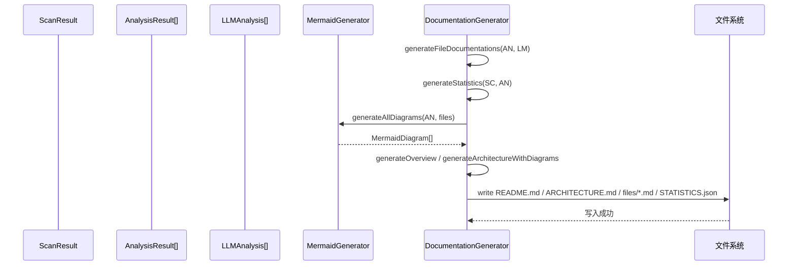

# 文档生成子系统指南（src/core/generator）

## 职责与范围
- 汇总扫描/分析/LLM 结果，生成结构化项目文档与统计，并输出 Mermaid 图表。

## 主要文件
- `DocumentationGenerator.ts`：核心编排；输出 `insight-docs/README.md`、`ARCHITECTURE.md`、`files/*.md`、`STATISTICS.json`。
- `MermaidGenerator.ts`：类继承图、模块依赖图、架构总览图与复杂类细节图；支持节点/方法裁剪与主题。

## 输入/输出
- 输入：`ScanResult`、`AnalysisResult[]`、`LLMAnalysis[]`。
- 输出：`ProjectDocumentation`（overview/architecture/files/statistics/diagrams/generatedAt）。
- 可选模板：`generation.templates` 目录的 `.hbs/.handlebars` 文件（若不存在则走内置 fallback）。

## 失败与可观测性
- 写盘失败/目录无权限：抛错并记录 `logger.error`。
- 图表生成异常：记录并回退为“无图表”占位；不阻断文档生成。
- 统计可通过 `getStats()` 查看格式/模板加载数量。

## 性能与边界
- 图表节点/方法默认限制，避免渲染过载（`maxNodesPerDiagram`，方法列表限前 N 个）。
- 依赖分析/架构归类基于启发式，必要时在模板中补充人工说明。

## 扩展建议
- 自定义模板：新增 `overview.hbs`、`architecture.hbs` 等模板，并在配置中指向目录。
- 图表风格：在 `MermaidGenerator` 中扩展主题与筛选规则。

## 快速验证
```bash
insight dev analyze ./examples --max-files 3
insight dev serve --open  # 浏览 README.md/ARCHITECTURE.md 与 Mermaid 渲染
```

## 深入细节（实现脉络）
- generate(scanResult, analyses, llmAnalyses)
  - 组合并生成文件级文档：`generateFileDocumentations()` 将 AST 与 LLMAnalysis 合并为结构化 `FileDocumentation`（类/方法/函数/导入/复杂度/建议）。
  - 统计：`generateStatistics()` 产出文件/行数/函数/类/语言分布与复杂度分布/均值。
  - 概览与架构：
    - 概览：模板优先（`overview.hbs`），无模板走 fallback 文本。
    - 架构：分析结构、识别启发式模式→ `generateArchitectureWithDiagrams()` 拼接 Mermaid 图 Markdown。
  - 图表：`MermaidGenerator.generateAllDiagrams()` 生成类继承图、模块依赖图、架构总览图、复杂类细节图（带节点/方法裁剪）。
  - 落盘：`writeDocumentation()` 输出 `README.md`、`ARCHITECTURE.md`、`files/*.md`、`STATISTICS.json`。
- 模板机制
  - `initializeTemplates()` 注册 helpers，若配置 `generation.templates` 存在则读取 `.hbs/.handlebars` 编译注册为 `overview`/`architecture` 等模板。
  - 模板不存在即使用内置 fallback 文本生成器。

## 时序图（Mermaid）


## 性能与边界
- 图表规模：对节点/方法有上限（如每类方法前 N 个、总节点上限）以避免渲染过载；超限会裁剪信息，适合大仓初览。
- 依赖/架构启发式：模块依赖/层次归类基于命名与目录结构，存在误判；可结合模板注入人工说明或标注“不确定”。
- I/O：大量文件写入 `files/*.md` 可成为瓶颈；建议未来批量并发写入并控制并发度。
- 模板缺省：无模板时 fallback 保证可用，但表达力有限；推荐逐步引入模板提升可读性与一致性。

## 改进清单（优先级）
1) 高 P0：文件文档写入并发（p-limit 8~16）+ 分批落盘，缩短整体时延。
2) 高 P0：图表可配置裁剪策略（按复杂度/调用热度/目录层级），导出“裁剪说明”防信息误解。
3) 中 P1：模块依赖判定增强（结合 imports 与内部路径映射），区分内部/外部依赖更稳健。
4) 中 P1：模板化覆盖：提供默认 `overview.hbs`/`architecture.hbs` 样板，暴露更多上下文变量（复杂度分布、错误分布）。
5) 中 P1：统计与质量门禁：在 `STATISTICS.json` 中附带阈值判断（如覆盖率/复杂度）并在 CLI 总结中提示。
6) 低 P2：图表缓存（按 AnalysisResult/文件哈希），避免无变更重复生成。

## 验证清单（建议步骤）
- 图表渲染：`insight dev analyze … && insight dev serve --open`，确认“类继承/模块依赖/架构总览/复杂类细节”均能渲染且可下载 SVG/PNG。
- 规模边界：千级文件项目下确认图表裁剪生效，页面可加载；观察日志“Generated X Mermaid diagrams”。
- 统计正确性：比对 `STATISTICS.json` 与页面概览总数/均值；抽样核对文件文档中的行号/入参/返回值映射。
- 模板覆盖：在 `templates/` 放置 `overview.hbs`，确认被正确加载与渲染；删除后回退到内置模板。
