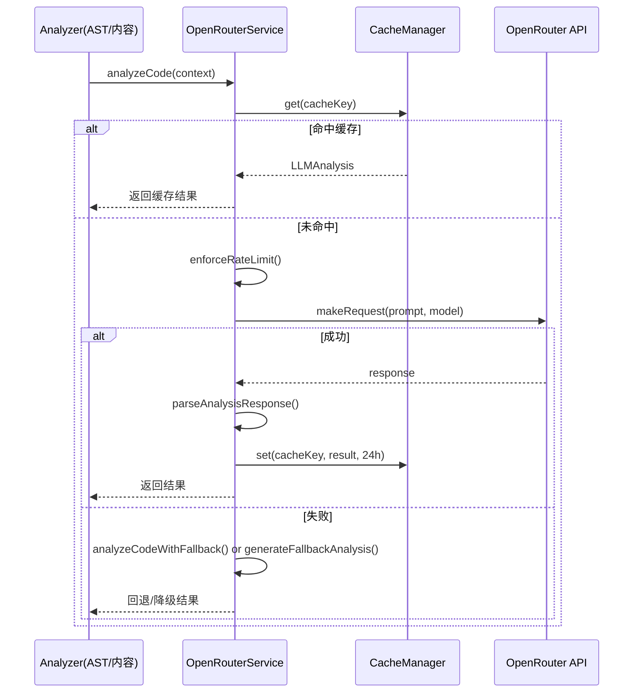

# LLM 服务子系统指南（src/core/llm）

## 职责与范围
- 将源码+AST 上下文提交至 OpenRouter，生成结构化文档块、架构建议与质量评估；带缓存与回退机制。

## 主要文件
- `OpenRouterService.ts`：构建提示词、请求 OpenRouter、解析响应，失败时使用 fallback 模型或本地 fallback 文档。

## 前置与配置
- 必需：`OPENROUTER_API_KEY`。可选：`MODEL` 覆盖主模型。
- 速率限制：最小请求间隔 100ms。

## 输入/输出
- 输入：`CodeContext`（filePath/language/content/ast）。
- 输出：`LLMAnalysis`（summary、documentation[]、architecture、quality）。
- 缓存：`CacheManager` 基于内容+上下文（模型名、AST 摘要）生成 key，默认 TTL 24h。

## 失败与可观测性
- 网络/配额/响应格式异常：记录错误并在有 fallback 模型时重试，否则生成本地 fallback 分析。
- 统计：`getStats()` 返回请求计数与模型信息；`logger.info/error` 输出阶段耗时与命中情况。

## 扩展建议
- 模型切换：在配置中调整 `llm.models.primary/fallback`，或通过 `MODEL` 环境变量覆盖。
- 提示词结构：可细化 `buildAnalysisPrompt`，加入更多静态分析信号（复杂度分布、依赖图摘要）。

## 快速验证
```bash
# 环境变量与连通性
export OPENROUTER_API_KEY=…
# 通过 analyze 触发端到端（含缓存）
insight dev analyze ./examples --max-files 2 --verbose
```

## 深入细节（实现脉络）
- analyzeCode(context)
  - 生成缓存键：以源码内容 + 上下文（模型名、文件路径、语言、AST 摘要：函数/类数、复杂度）计算 sha256。
  - 命中缓存：直接返回缓存文档（默认 TTL 24h）。
  - 速率限制：`enforceRateLimit()` 保证相邻请求≥100ms，避免触发配额限速。
  - 构造提示词：`buildAnalysisPrompt()` 汇入文件路径/语言/行数/复杂度/函数与类清单/导入，以及最多约 4000 字符的源码片段（超长时截断）。
  - 调用 API：`makeRequest()` 访问 `https://openrouter.ai/api/v1/chat/completions`，携带模型、温度、max_tokens 与必要 Header。
  - 解析响应：`parseAnalysisResponse()` 基于 Markdown 粗解析（提取 Summary 与为类/函数生成文档块），并附带架构/质量的默认值与导入依赖。
  - 缓存写入：成功后写入 CacheManager（内存+磁盘）。
  - 失败回退：若主模型失败且存在 fallback，则 `analyzeCodeWithFallback()` 尝试（会下调 max_tokens≤2048）；仍失败则 `generateFallbackAnalysis()` 基于 AST 生成最小可用文档。

## 时序图（Mermaid）


## 性能与边界
- 速率与并发：最小 100ms 间隔；建议在高并发时分片节流或队列化，避免429。
- 提示长度：源码片段仅截取前 4000 字符，过长文件的尾部上下文会丢失；建议配合“基于 AST 的片段选择/多段合并”。
- token 与模型：fallback 分支 max_tokens ≤ 2048；不同模型 token 额度/响应格式可能差异。
- 解析稳健性：当前 Markdown 粗解析，遇到模型输出风格变化可能丢字段或偏差。
- 缓存：键包含内容与 AST 摘要，TTL 24h；若模板/提示词发生结构性变化，建议 bump “promptVersion” 进入缓存键以避开旧值。

## 改进清单（优先级）
1) 高 P0：将响应改为“结构化 JSON Schema”并在提示中强制格式；解析前做 JSON 校验与回退策略。
2) 高 P0：指数退避+有限重试（对 429/5xx/网络抖动），分类型错误归因（配额、网络、格式）。
3) 中 P1：上下文切片策略（函数/类 Top-K、按复杂度或依赖热度选择），支持多轮合并生成更完整文档。
4) 中 P1：缓存键加入 `promptVersion`、模型版本、解析器版本，规避协议演进导致的伪命中。
5) 中 P1：成本/时间遥测（请求时长、缓存命中率、平均 tokens），在 CLI “Summary” 展示。
6) 低 P2：支持流式/分段生成与断点续写（大仓重入），并行多文件时引入 p-limit 并考虑项目级速率预算。

## 验证清单（建议步骤）
- 连通性：设置 `OPENROUTER_API_KEY` 后运行 `insight dev analyze ./examples --max-files 1 --verbose`，观察“Initialized with model”“Using cached analysis”。
- 回退路径：将主模型名设为无效，保留 fallback，预期触发 fallback 分支。
- 缓存命中：连续运行两次相同命令，第二次应“Using cached analysis”；修改文件内容/模型名，应重新触发请求。
- 速率/并发：在中等规模上提升并发（未来若加入 p-limit），验证 429 降低与吞吐关系。
