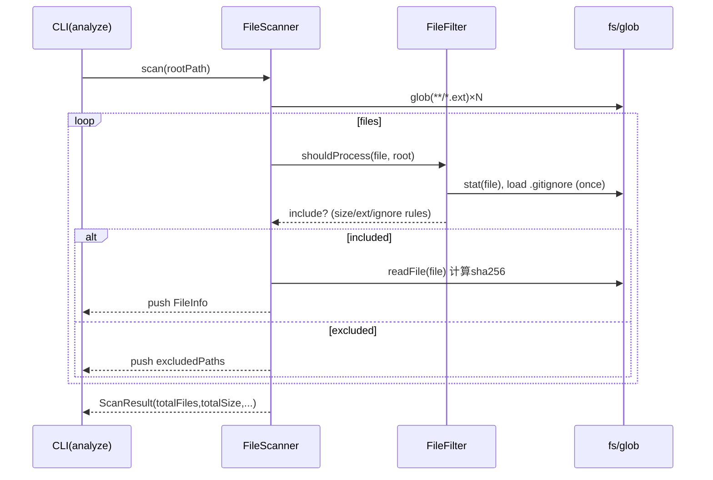

# 扫描器子系统指南（src/core/scanner）

## 职责与范围
- 发现待分析文件：基于 `insight.config.json` 的 `scanning` 配置（扩展名、忽略、大小上限）。
- 产出可消费的文件清单（含哈希、大小、语言、修改时间）。

## 主要文件
- `FileScanner.ts`：入口，glob 匹配、去重、汇总统计，输出 `ScanResult`。
- `FileFilter.ts`：尺寸/扩展名/.gitignore/固定忽略（node_modules、__pycache__ 等）规则判断。

## 输入/输出
- 输入：根目录路径、`InsightConfig.scanning`。
- 输出：`ScanResult`（files: `FileInfo[]`, totalFiles/totalSize, scannedPaths/excludedPaths）。
- `FileInfo`：path/size/hash/language/lastModified。

## 失败与可观测性
- 常见失败：路径不存在/非目录、glob 错误、文件读取失败、超大小被过滤。
- 日志：`logger.debug/info/warn`；建议在 `--verbose` 下观察 `Glob patterns`、过滤命中原因。

## 性能与边界
- glob `maxDepth: 10`，避免深度遍历爆炸；去重+排序。
- 大文件硬阈值（默认 1MB，`maxFileSize` 支持 KB/MB/GB 文法）。
- .gitignore 仅支持正向模式（开头 `!` 的否定规则暂跳过）。

## 扩展建议
- 扩展语言：在 `includeExtensions` 增加扩展名，并在分析器侧实现对应解析。
- 复杂忽略：如需否定规则，可在 `FileFilter.loadGitignorePatterns` 补完处理。

## 快速验证
```bash
# 观察过滤与统计（建议加 --verbose）
insight dev analyze ./examples --max-files 5 --verbose
```

## 深入细节（实现脉络）
- FileScanner.scan(rootPath)
  - 校验路径 → 构造 `includeExtensions` 的 glob 模式（如 `**/*.py`）→ `findFiles(patterns)` 扫描 → 逐个文件用 `FileFilter.shouldProcess()` 决定是否纳入 → `createFileInfo()` 读取 stat + 内容并计算 sha256（前 16 位）→ 汇总统计与时长日志。
- FileFilter.shouldProcess(file, root)
  - 判定是文件 → 尺寸阈值（`maxFileSize`，支持 KB/MB/GB）→ 扩展名白名单 → `isIgnored()`（配置忽略 + .gitignore + 内置常见忽略）→ 通过则纳入。
- isIgnored 细节
  - 懒加载 `.gitignore`，仅处理正向模式；否定 `!pattern` 暂不生效（会跳过并记录 debug）。
  - 匹配策略：对相对路径与绝对路径分别以 minimatch 检查，包含隐藏文件（dot: true）。

## 时序图（Mermaid）


## 性能与边界
- I/O 热点：`createFileInfo()` 读取全文以计算哈希，项目大时会造成 I/O 压力；可考虑流式 hash 或延后到分析阶段再算。
- 并发：当前逐文件串行，可用 `p-limit` 控制并发（如 8~16）减少整体时延。
- 深度：glob `maxDepth:10` 防止递归爆炸；如需更深需谨慎评估体量与忽略规则。
- 符号链接：`follow:false` 默认不追踪，避免链接环。
- 忽略语义：.gitignore 未实现否定规则（`!pattern`），复杂场景可能与 Git 不一致。

## 改进清单（优先级建议）
1) 高 P0：为 `.gitignore` 增加否定规则支持；在调试输出中给出“被忽略原因”。
2) 高 P0：扫描阶段避免全文读取，改为流式 hash 或仅 stat+mtime 作为初筛，AST/LLM 前再精确校验内容哈希。
3) 中 P1：加入并发扫描（`p-limit`）与文件批处理，显著缩短大仓库首扫时延。
4) 中 P1：Dry-run/Explain 模式（例如 `--explain-filter`）列出包含/排除清单与规则命中链路。
5) 中 P1：按语言扩展组装 patterns（多语言时一次性构造），并将语言判定抽取为 util。
6) 低 P2：对超大文件提供“跳过并记录”与“截断读取计算 hash”的策略选择。

## 验证清单（建议步骤）
- 小仓快验：`--max-files 5 --verbose` 观察 Glob patterns、过滤原因、统计与耗时。
- 大仓稳验：制造 1.5MB+ 文件验证尺寸阈值；在 `.gitignore` 中添加/取消某条规则验证忽略生效。
- 负载压测：千级文件仓库下统计扫描耗时，评估并发/流式 hash 的收益。
