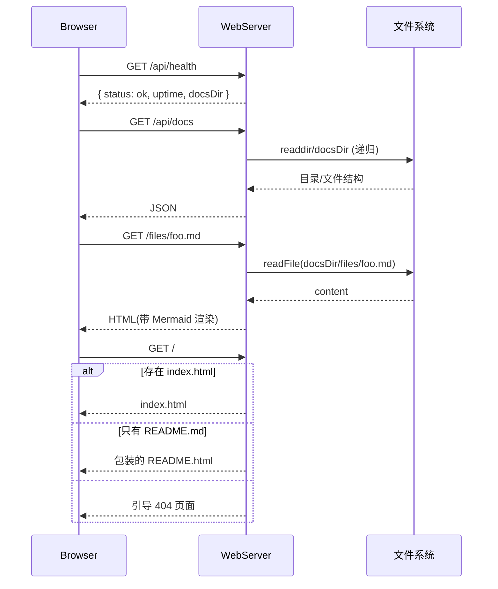

# 文档服务子系统指南（src/core/server）

## 职责与范围
- 提供文档浏览的 HTTP 服务，静态托管/Markdown 包装渲染、Mermaid 前端渲染，API 返回目录结构与文件内容。

## 主要文件
- `WebServer.ts`：基于 Express；中间件、路由与 HTML 包装（带 Mermaid/下载/缩放控件）。

## 路由与行为
- `GET /`：优先返回 `index.html`；无则将 `README.md` 包装为 HTML 返回；再无则返回引导 404 页。
- `GET /api/health`：运行状态、docs 路径、uptime。
- `GET /api/docs`：文档目录结构（递归）。
- `GET /api/docs/:filename`：返回文件内容与元信息。
- `/*.md`：将任意 Markdown 包裹成 HTML 页面（含 Mermaid 渲染）。

## 失败与可观测性
- 目录不存在/为空：友好的引导页与日志提示（先 `analyze` 再 `serve`）。
- 端口占用：抛错 `EADDRINUSE` 并提示使用其他端口。
- `--verbose` 输出请求日志。

## 扩展建议
- 可添加静态资源（CSS/JS）目录，或接入 SPA 前端。
- 若需鉴权/跨域特化，可扩展 CORS/认证中间件。

## 快速验证
```bash
insight dev serve --docs-dir insight-docs --open
```

## 深入细节（实现脉络）
- 中间件
  - CORS 启用；`express.json()` 解析 JSON；`--verbose` 时输出每次请求 method/path。
  - 静态托管对非 `.md` 路径生效；`.md` 由专用路由包装成 HTML（避免被静态中间件短路）。
- 路由
  - `GET /api/docs`：读取 `docsDir`，递归生成目录/文件结构（含 size/mtime/type），汇总 `totalFiles/lastModified`。
  - `GET /api/docs/:filename`：返回指定文件的内容与元信息（不支持嵌套目录名）；
  - `GET /*.md`：对任意子路径的 `.md` 文件进行 HTML 包装，注入 Mermaid，并提供 SVG/PNG 下载、缩放等控件。
  - `GET /`/fallback：优先 `index.html`，其次用 `README.md` 包装，均不存在则返回引导 404 页面（含操作提示）。
- HTML 包装
  - `wrapMarkdownInHTML(content, title)`：构造页面骨架、样式与前端脚本；`processMermaidBlocks()` 识别三引号 mermaid 代码块并替换为 div.mermaid。
- 启停
  - `start()`：listen 成功打印 URL 与 docsDir；端口占用抛 `EADDRINUSE`。
  - `stop()`：graceful 关闭并打印状态。

## 时序图（Mermaid）


## 性能与边界
- 目录遍历：`/api/docs` 读取全目录，极大目录可能较慢；建议后续加入分页/延迟加载或缓存结构。
- 文件读取：包装 `.md` 时读取全文构建页面；超大 Markdown 会影响首屏与前端渲染。
- 安全：全局 CORS 开启、未做鉴权；Markdown 未做 XSS 级别过滤（目前主要以 `<pre>`/代码块呈现，仍建议加净化）。
- 路径支持：`/api/docs/:filename` 仅支持一层文件名；多级嵌套以 `/*.md` 渲染页面可访问，API 读取可扩展。

## 改进清单（优先级）
1) 高 P0：静态内容缓存与 ETag/Last-Modified；`/api/docs` 结果缓存（监听 mtime 失效）。
2) 高 P0：加入 `compression` 中间件与可选 `helmet` 安全头；可选鉴权（Basic/Bearer）。
3) 中 P1：增强 `/api/docs/:path+` 支持多级子路径；对 `.md` 提供“原始 Markdown”与“HTML 包装”双模式响应。
4) 中 P1：XSS 处理：渲染/注入前对 Markdown 进行净化（DOMPurify/marked+sanitize）。
5) 中 P1：Mermaid 前端渲染失败回退（错误提示与重试），并提供“导出全部图表”的批量下载按钮。
6) 低 P2：目录观察/热更新：文件变化时推送简单事件或刷新提示；错误页可提供一键 links 到分析命令。

## 验证清单（建议步骤）
- 空目录：仅创建空的 `insight-docs/`，访问 `/` 应返回引导页；`/api/health` 正常。
- 基础巡检：访问 `/api/docs` 返回结构；`/api/docs/README.md` 返回内容 JSON；`/files/*.md` 页面能渲染 Mermaid 并下载 SVG/PNG。
- 大目录：复制数百个 `.md` 测试 `/api/docs` 的时延与日志；若加入缓存，观察响应时延改善。
- 路径边界：在子目录 `files/` 下嵌套多级 Markdown，验证 `/*.md` 能正确访问；确认 `/api/docs/:filename` 的一层限制。
