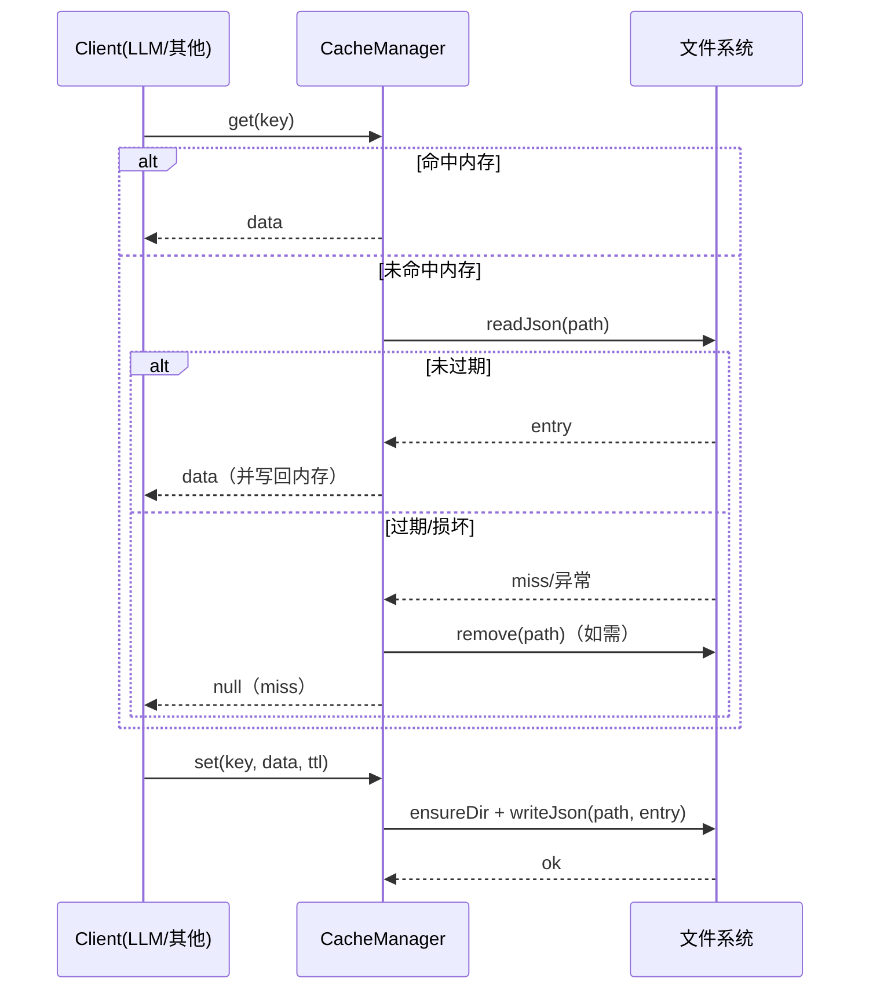

# 缓存服务子系统指南（src/services/cache）

## 职责与范围
- 提供内存+磁盘的通用 KV 缓存，支持 TTL、清理、统计、memoize 与跨进程持久化。

## 主要文件
- `CacheManager.ts`：核心实现与单例 `getCacheManager()`。

## 行为与接口
- 生成键：`generateKey(content, context)`（SHA-256）。
- 读写：`get/set/has/delete/clear`；磁盘结构为前缀分片 `XX/<hash>.json`。
- 维护：`cleanup()` 清理过期/损坏条目；`getStats()` 返回内存/磁盘条目与体积。
- 工具：`memoize(key, asyncFn, ttl)`。

## 配置
- 目录与 TTL：默认 `.insight-cache` 与 86400s，可通过环境变量 `INSIGHT_CACHE_DIR` 或构造参数覆盖。

## 失败与可观测性
- 磁盘 IO/损坏 JSON：自动移除并告警；所有操作带 `logger.debug/info/warn/error`。

## 扩展建议
- 持久化后端：可替换为 LevelDB/SQLite/Redis；保留相同方法签名以降低耦合。
- 压缩：大对象可引入 gzip/ brotli 降低磁盘占用。

## 快速验证
```bash
# 运行 analyze，两次执行观察 LLM 缓存命中差异
insight dev analyze ./examples --max-files 2 --verbose
```

## 深入细节（实现脉络）
- 缓存键：`generateKey(content, context)` 将内容串 + 上下文 JSON 串联后做 sha256，适合幂等读写；建议在 context 中加入 `promptVersion`/模型名/解析器版本。
- 存取路径：`getCachePath(key)` 以 key 前两位做子目录分片，避免单目录过多文件：`<cacheDir>/<XX>/<key>.json`。
- 读路径：先查内存 Map 命中且未过期→返回；否则读磁盘 JSON，校验 TTL → 命中则写回内存并返回；失败/过期则清理并 miss。
- 写路径：写入内存 Map → `ensureDir(dirname)` 保证目录存在 → `writeJson(file, entry, {spaces:2})` 持久化。
- 清理：`cleanup()` 清除内存中过期项；扫描磁盘分片 JSON，删除过期或损坏文件（读 JSON 失败视为损坏）。
- 统计：`getStats()` 统计内存条目、磁盘条目个数、总体积、最老文件 mtime；便于评估“冷/热”占比。

## 时序图（Mermaid）


## 性能与边界
- JSON 体积：大对象读写会产生明显 I/O；可选压缩（gzip/brotli）或分片存放二进制块（但会牺牲可读性）。
- 并发与原子性：多进程并发写同一 key 可能导致后写覆盖；必要时考虑文件锁或“临时文件 + 原子改名”。
- TTL 语义：基于 `timestamp + ttl(ms)` 的绝对过期；系统时钟漂移可能影响精度（通常可忽略）。
- 清理成本：磁盘清理是 O(N) 文件遍历，建议在定时或低峰触发；也可按分片目录做渐进清理。

## 改进清单（优先级）
1) 高 P0：持久化原子写入（`writeJson` → 写临时文件再 `rename`），并在异常时自动回滚。
2) 高 P0：键版本化：统一在 context 引入 `schemaVersion/promptVersion/modelVersion`，避免协议调整导致伪命中。
3) 中 P1：容量策略：加入“最大磁盘体积/最大条数”与 LRU 淘汰，防止无上限增长。
4) 中 P1：压缩可选项：对超过阈值的 entry 透明压缩；读取侧自动解压。
5) 中 P1：并发保护：引入轻量锁（基于 `<key>.lock` 或内存热点锁），避免抖动下的重复写。
6) 低 P2：遥测：命中率、写入失败数、平均读写耗时，暴露到 CLI “Summary”。

## 验证清单（建议步骤）
- 命中验证：同一 analyze 连续执行两次，第二次应 hit；修改模型名或源码内容应 miss 并重算。
- 过期验证：将 TTL 降到 1s，等待 2s 再读取，应自动 miss 并删除过期磁盘文件。
- 损坏文件：手工篡改某 `.json`（写入无效 JSON），调用 `get()` 应 warn 并移除；流程保持可用。
- 并发写：并行触发多次相同 `set`（可写脚本），验证最终一致性与无异常；必要时评估锁的收益。
