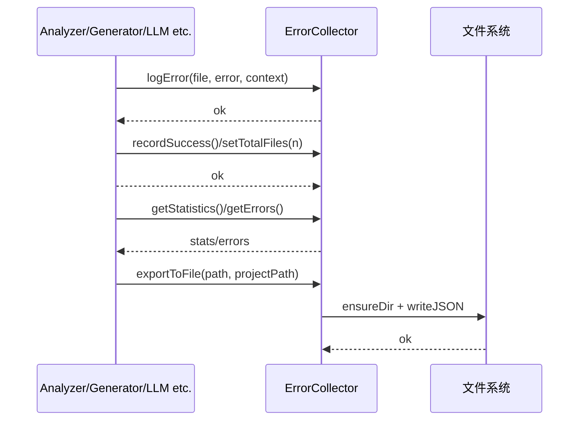

# 错误采集子系统指南（src/services/errors）

## 职责与范围
- 收集分析/处理过程中的失败事件，统一分类、累计统计、终端输出与可选导出 JSON 报告。

## 主要文件
- `ErrorCollector.ts`：记录错误、计算成功/失败/成功率、按类型聚合、控制台摘要、导出 `ErrorReport`。

## 错误模型
- 分类（示例）：`syntax_error`、`encoding_error`、`timeout_error`、`memory_error`、`file_access_error`、`network_error`、`unknown_error`。
- 记录内容：`file`、`message`、`errorType`、`timestamp`、`context`（大小、行数、编码等）。

## 输入/输出
- 输入：`logError(file, error, context?)`、`recordSuccess()`、`setTotalFiles(n)`。
- 输出：`getStatistics()`、`getErrors()`、`printSummary()`、`exportToFile(path, projectPath)`。

## 使用约定
- CLI `analyze` 支持：`--continue-on-error`（默认）或 `--stop-on-error`；`--error-report` 输出 JSON 细节。

## 快速验证
```bash
insight dev analyze ./examples --max-files 5 --error-report --verbose
# 结束后查看控制台摘要与导出 JSON（默认到输出目录内）
```

## 深入细节（实现脉络）
- 记录：`logError(file, error, context?)`
  - 解析 `error.message`（小写）映射到分类：包含 `syntax/unexpected token` → syntax_error；`encoding/utf-8/decode` → encoding_error；`timeout` → timeout_error；`memory/heap` → memory_error；`enoent/permission` 等 → file_access_error；`network` → network_error；否则 unknown_error。
  - 推入内部数组并累计计数；在 `DEBUG` 模式下输出堆栈。
- 成功：`recordSuccess()` 自增成功数。
- 汇总：`getStatistics()` 计算成功/失败/总数、成功率、错误按类型聚合与处理时长；`printSummary()` 在 CLI 友好展示并提示 `--error-report`。
- 导出：`exportToFile(path, projectPath)` 写入包含 `timestamp/project/summary/errors[]` 的 JSON；errors 记录 file、errorType、message、context。
- 容错：所有导出路径均 `ensureDir`；写失败抛告警但不影响主流程。

## 时序图（Mermaid）


## 性能与边界
- 规模：错误记录常为数量级较小的数组，JSON 导出体量有限；极端情况下建议分页写出或限制最大错误条目。
- 分类规则：基于消息的启发式，存在误分类/多语种差异；建议记录 `raw` 字段供二次分析。
- 并发：同进程内方法为同步内存操作，线程安全；多进程聚合可通过合并 JSON 报告达成。

## 改进清单（优先级）
1) 高 P0：错误码表与严重性等级（fatal/warn/info）标准化，CLI 以颜色/图标区分。
2) 高 P0：去重与聚合（按 file + errorType + message hash），控制导出规模并突出“顶级根因”。
3) 中 P1：可插拔 Sink：支持输出到自定义处理器（如文件/控制台/HTTP webhook），便于接入告警或平台化。
4) 中 P1：隐私清洗：在导出前对路径/机密串做脱敏（正则白名单）。
5) 低 P2：错误趋势：将 `processing_duration_ms`、错误分布纳入项目级报表，供质量门禁。

## 验证清单（建议步骤）
- 分类准确性：构造 encoding/timeout/memory/语法错误样本，检查分类；构造未知错误，落到 unknown_error。
- 去重聚合：批量注入重复错误，验证聚合策略（实现后）。
- 导出可靠性：只读目录/无权限场景，验证导出失败的日志与主流程不中断。
