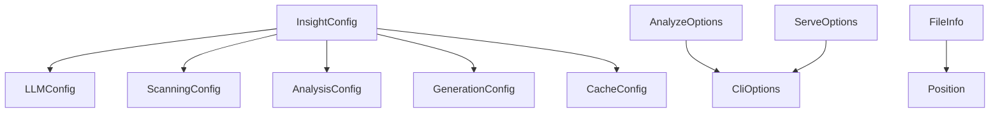

# 类型定义指南（src/types）

## 职责与范围
- 统一配置、扫描、分析、生成、服务层的公共类型，降低模块耦合，提升重构与协作效率。

## 关键类型（节选）
- `InsightConfig`：llm/scanning/analysis/generation/cache 总配置。
- `LLMConfig`：provider、models、maxTokens、temperature。
- `ScanningConfig`：ignorePaths、includeExtensions、maxFileSize。
- `FileInfo`：path/size/hash/language/lastModified。
- `AnalysisResult`（types 里旧版）：file/ast/chunks/documentation（注意：core/analyzer 有新版 `AnalysisResult`，请按使用上下文区分）。
- CLI：`AnalyzeOptions`、`ServeOptions`、`CliOptions`。

## 一致性与演进
- 注意 `src/core/analyzer/ASTAnalyzer.ts` 中自定义 `AnalysisResult` 与本目录旧版的同名类型并存；在调用处使用显式导入路径避免混淆。
- 如需合并，请先在调用方统一结构，再进行一次性迁移。

## 扩展建议
- 为新增模块补充类型与注释，避免 `any`；在 `vitest` 中添加类型守卫测试（若适用）。

## 快速验证
```bash
pnpm type-check
```

## 深入细节（类型关系）
- 配置域：`InsightConfig` 聚合 `LLMConfig/ScanningConfig/AnalysisConfig/GenerationConfig/CacheConfig`；由 `utils/config` 读写。
- CLI 域：`CliOptions/AnalyzeOptions/ServeOptions` 为命令层输入；`src/cli` 直接依赖。
- 文件/位置：`FileInfo/Position` 贯穿扫描与分析；需与 `core/scanner` 的结构对齐。
- 命名冲突：本目录有旧版 `AnalysisResult`（面向早期 generator 流水线），而 `src/core/analyzer/ASTAnalyzer.ts` 定义了新版 `AnalysisResult`（更丰富字段）。调用点需显式从对应路径导入，避免混淆。

## Mermaid（依赖简图）


## 一致性与演进策略
- 统一口径：后续若要合并两个 `AnalysisResult`，应先在 generator/LLM 侧统一字段命名与职责分层（如 AST 专有 vs 文档专有），再进行迁移。
- 命名规范：避免过度通用名；对于仅在某域使用的类型，考虑放入该域并 re-export 必要子集。
- 文档注释：为公开类型补充 JSDoc，说明来源/单位/边界（如“复杂度为启发式 1-10”）。

## 改进清单（优先级）
1) 高 P0：为配置类型增加只读属性与精确字面量（如 provider 联合类型），减少运行期非法值。
2) 中 P1：引入类型测试（vitest）校验“结构兼容性”（示例对象通过编译），防止重构破坏外部依赖。
3) 低 P2：建立“公共 vs 领域专有”的导出白名单，降低类型爆炸与歧义。

## 验证清单（建议步骤）
- 目录消费方编译：在 `src/cli`/`src/core/*` 引用公共类型并 `pnpm type-check`，保证无循环依赖与冲突。
- 冲突演示：故意从错误的路径导入 `AnalysisResult`，确认 TS 编译提示能帮助定位问题（作为培训材料）。
