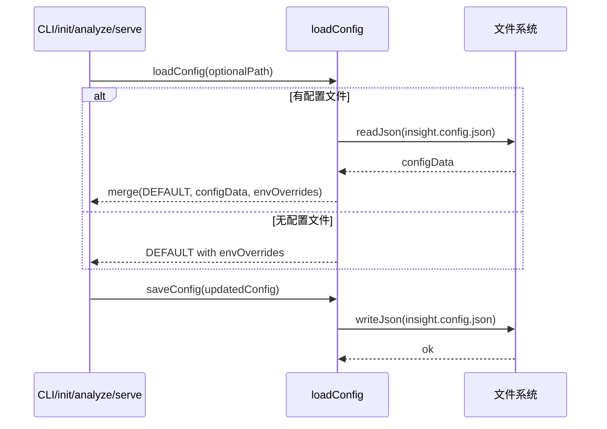

# 工具层指南（src/utils）

## 职责与范围
- 提供配置加载/保存与日志工具，两者贯穿 CLI 与核心模块的可观测性与行为控制。

## 主要文件
- `config.ts`：默认配置合并 `insight.config.json` 与环境变量（`MODEL` 覆盖主模型），提供 `loadConfig/saveConfig`。
- `logger.ts`：统一日志接口，支持 `setLevel(0)` 开启 DEBUG 细粒度输出（CLI `--verbose` 会设置）。

## 配置要点（默认）
- LLM：provider、primary/fallback、`maxTokens`、`temperature`。
- 扫描：`ignorePaths`、`includeExtensions=['.py']`、`maxFileSize='1MB'`。
- 生成：`outputDir='insight-docs'`、`format='markdown'`、`templates='templates/'`。
- 缓存：`enabled=true`、`location='.insight-cache'`、`ttl=86400`。

## 扩展建议
- 为新的 CLI 选项补充同名配置项，并维护 `src/types` 类型定义与 `insight.config.json` 示例。
- logger 保持简单直接，复杂场景可接入 pino/winston，并在 CLI 提供 `--log-level`。

## 快速验证
```bash
# 读取配置（含环境变量覆盖提示）
MODEL=google/gemini-2.0-flash-lite-001 insight dev analyze ./examples --max-files 1
```

## 深入细节（实现脉络）
- 配置加载 `loadConfig(path?)`
  - 默认路径 `./insight.config.json` 存在则读取并与 `DEFAULT_CONFIG` 浅合并（保留未配置项）。
  - 环境变量覆盖：`MODEL` 会覆盖 `llm.models.primary` 并打印提示；其他敏感变量（如 `OPENROUTER_API_KEY`）不写回配置，仅在运行期使用。
  - 返回合并后的强类型 `InsightConfig`。
- 配置保存 `saveConfig(config, path?)`
  - 写入 JSON（2 空格缩进），供 CLI `init` 使用；调用前应保证类型/必填项完整。
- 日志 `logger`
  - 等级：`setLevel(0)` 开启 DEBUG；CLI `--verbose` 会调用。
  - 统一在 CLI/核心模块使用，保证输出风格一致；错误场景使用 `error`，成功要点用 `success/info`。

## Mermaid（流程）


## 性能与边界
- 配置体量小，读取/写入成本忽略不计；主要注意并发写入一致性（通常发生在 `init` 交互中）。
- 环境覆盖范围目前仅 `MODEL`；若覆盖矩阵扩大，需统一约定命名前缀与优先级（env > CLI 选项 > 文件 > 默认）。

## 改进清单（优先级）
1) 高 P0：引入 Schema 校验（zod/typia），对外部配置文件做严格验证与默认值填充，输出友好错误。
2) 中 P1：扩展 env 覆盖矩阵（如 `INSIGHT_OUTPUT_DIR`/`INSIGHT_CACHE_DIR`），并在 `--verbose` 模式下打印覆盖来源。
3) 中 P1：logger 增加时间戳与可选 JSON 模式（便于被外部收集器解析）。
4) 低 P2：配置热加载（watch 文件）与变更提示（对 server 有意义）。

## 验证清单（建议步骤）
- 无配置文件：直接运行 analyze，确认加载 DEFAULT 并能通过 env 覆盖主模型。
- 配置合并：手工创建 insight.config.json，改变 scanning/includeExtensions，确认生效。
- 错配文件：写入不合法字段（实现 schema 后），期望报出人类可读的校验错误。
